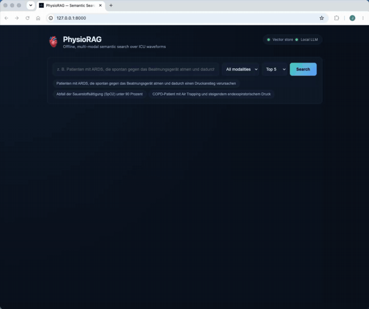

# 🫀 PhysioRAG: Offline-First Multi-Modal RAG for Clinical Time-Series Data

[](https://www.python.org/downloads/)
[](https://opensource.org/licenses/MIT)
[](https://github.com/jorgebmann/pyturboquant)

**Natural-language, air-gapped semantic search over high-frequency physiological
waveforms** (ventilator pressure/flow, SpO2, ECG) and the clinical text that
describes them — running entirely on your own machine.



> **Research & engineering software — not a medical device.** See the
> [disclaimer](#-disclaimer).

## ⚡ Quickstart (synthetic demo, ~3 minutes, fully offline)

No Docker, no PhysioNet credentials, no cloud API. The demo runs a **fully
synthetic** ventilator dataset in a single process.

```bash
# 1. Clone
git clone https://github.com/jorgebmann/PhysioRAG.git
cd PhysioRAG

# 2. Install (Python >= 3.12)
python3.12 -m venv .venv && source .venv/bin/activate
pip install -e ".[dev]"

# 3. Serve the demo (auto-ingests synthetic data, then serves the search UI)
python scripts/serve_demo.py
```

Open **http://127.0.0.1:8000/**, type a query (or click an example chip), and
see the matched waveform epochs rendered as plots.

Try, for example:

- *"ARDS patient breathing spontaneously against the ventilator causing a pressure spike"*
- *"COPD-Patient mit Air Trapping und steigendem endexspiratorischem Druck"* (German works too)

The text encoder (`all-MiniLM-L6-v2`, ~90 MB) downloads to your local Hugging
Face cache on first run; after that the demo needs no network. If the encoder
can't load, search degrades to BM25/keyword over the captions rather than
failing. If [Ollama](https://ollama.com/) is running with `llama3.1`, `/search`
also returns a grounded answer that cites the epoch ids it used.

## 🚀 The Problem & Our Solution

Hospitals, CROs, and MedTech R&D departments produce terabytes of physiological
time-series data. Traditional RAG systems are entirely text-bound and cannot
interpret the "grammar" of machine signals.

**PhysioRAG** maps multi-modal sensor waveforms and clinical language into a
shared search space so signals and text are searchable together. It ships:

- a lightweight **1D-CNN baseline encoder** (`baseline_cnn`) for the ventilator
  track, and
- a **reused open ECG–language dual-encoder** ([MERL](https://github.com/cheliu-computation/MERL-ICML2024))
  for CLIP-style ECG search (see [ECG semantic search](#-ecg-semantic-search-phase-b--reused-merl-dual-encoder)).

Further modality-specific models (*PaPaGei*, *Chronos*) remain on the roadmap.

> **Example:** *"Find ventilator pressure curves showing ARDS patients breathing
> spontaneously against the machine."* → returns the exact ~10-second waveform
> snippets and associated metadata as plottable evidence, with an optional
> grounded LLM answer.

## ✨ Key Features

* 🔒 **Offline / air-gapped by design:** no data leaves the local machine and no
  external API is required. This makes PhysioRAG a good fit for **locally
  controlled, privacy-oriented architectures** for sensitive R&D and patient
  IP. (An air gap is a strong security control, not by itself a GDPR/HIPAA
  compliance certification — those need additional organizational measures.)
* 🧠 **Time-series to vector:** encodes raw 1D/2D signals into semantic embeddings.
* 📊 **Multi-modal retrieval:** searches across caption/metadata text and machine
  waveforms; the ECG track does true text → signal retrieval.
* ⚡ **Low hardware footprint:** integrates [pyturboquant](https://github.com/jorgebmann/pyturboquant)
  to compress embeddings so the pipeline runs on standard edge/R&D servers.
  (The vector index currently stores a dequantized `float32` reconstruction for
  ANN search; ingest reports compressed-byte and fidelity stats so "TurboQuant
  on" is measurable.)

## 🏗️ Architecture Pipeline

1. **Ingestion:** reads raw waveform data (e.g. WFDB from MIMIC-IV) or synthetic
   demo scenarios.
2. **Epoching & encoding:** slices signals into fixed windows (e.g. 10 s) and
   encodes them (`baseline_cnn` for ventilator; MERL for ECG).
3. **Quantization:** compresses embeddings with `pyturboquant` (optional
   `.[quant]` extra; otherwise a `float16` stub).
4. **Vector storage:** local vector store — in-memory for the demo, or Weaviate
   for the full stack.
5. **Retrieval & synthesis:** matches queries to epochs and (optionally) uses a
   local LLM (Llama 3.1 via Ollama) to synthesize a citation-grounded answer.

## 🧩 Full local stack (Weaviate + Ollama)

The quickstart above uses an in-memory store. To run the production-shaped stack
with a real vector DB and grounded synthesis:

```bash
# Weaviate (vector DB) — local Docker instance on :8080 (+ gRPC :50051)
docker run -d --name weaviate -p 8080:8080 -p 50051:50051 \
  -e ENABLE_MODULES="" -e AUTHENTICATION_ANONYMOUS_ACCESS_ENABLED=true \
  cr.weaviate.io/semitechnologies/weaviate:1.34.0

# Ollama (local LLM synthesis)
ollama pull llama3.1

# Include the real compressor and index the synthetic demo into Weaviate
pip install -e ".[dev,quant]"
python scripts/ingest_waveforms.py --dataset mimic_demo --modality ventilator --reset-collection

# Serve the API + UI against Weaviate (configs/default.yaml)
uvicorn api.main:app
```

`mimic_demo` is written to the `WaveformEpochDemo` collection so curated
scenarios are not drowned out by a larger real-WFDB index (`WaveformEpochV2`).
See [`configs/default.yaml`](configs/default.yaml).

Query it:

```bash
curl -X POST http://127.0.0.1:8000/search \
  -H 'Content-Type: application/json' \
  -d '{"query":"ARDS spontaneous breathing against the ventilator","top_k":3}'

# Each hit includes a plot_url; open the PNG of a returned epoch:
#   http://127.0.0.1:8000/waveforms/<epoch_id>?format=png
```

Interactive API docs live at `http://127.0.0.1:8000/docs`.

## 🫁 Ventilator retrieval (Phase C)

The synthetic ventilator demo covers labeled asynchrony scenarios (double
triggering, air trapping, ineffective effort, flow starvation, delayed cycling,
reverse triggering, low compliance, normal) as 2-channel `Paw`/`Flow` windows
with **bilingual (EN + DE) templated captions** and structured metadata
(`asynchrony_type`, `vent_mode`, `peep_cmh2o`, `diagnosis`, `finding`,
`pairing_tier`).

Retrieval is `hybrid_text`: a vent-only German→English glossary (applied only
for ventilator / unfiltered queries) rewrites the query, MiniLM searches the
caption text vector, and BM25 scores the caption plus promoted metadata
properties (reciprocal rank fusion of dense + keyword). Captions store real
umlauts so untranslated German still matches. **This is caption/metadata
retrieval, not CLIP-style text→signal alignment.** Each epoch carries a
`pairing_tier` tag: synthetic demo captions are **medium** (templated from labels,
not free-text morphology); real WFDB windows get **weak** auto-generated prose.
ICU free-text notes are **never** used as captions — they rarely pin an event to
a 10-second window.

```bash
# German Dräger-style query (glossary rewrites it to English under the hood):
curl -X POST http://127.0.0.1:8000/search \
  -H 'Content-Type: application/json' \
  -d '{"query":"Double Triggering unter Druckunterstützung","modality":"ventilator","top_k":3}'
```

Track retrieval quality with a frozen EN/DE query set (labeled Recall@k vs
chance; hybrid / MiniLM-only / keyword-only), split into a "caption" subset and
a harder "paraphrase" subset, with unlabeled distractor epochs so recall is not
trivially 1:

```bash
python scripts/eval_vent_retrieval.py --variants 3
# writes data/processed/vent_recall.json (with a by_subset block)
# add --backend weaviate to score on the live product fusion
```

## 🫀 ECG semantic search (Phase B — reused MERL dual-encoder)

PhysioRAG can search **12-lead ECG** by natural language using an open
ECG–language dual-encoder ([MERL](https://github.com/cheliu-computation/MERL-ICML2024),
Liu et al., ICML 2024) — **no training required**. The ECG signal tower produces
the index vector; the matched Med-CPT text tower embeds queries into the *same*
256-d space, so retrieval runs CLIP-style (text → ECG signal) rather than the
ventilator MiniLM/BM25 hybrid. This lives in its own config and collection; the
ventilator default ([`configs/default.yaml`](configs/default.yaml)) is untouched.

### 1. Get the MERL checkpoint (once, online)

Download the **full** `*_ckpt.pth` (both towers — the `*_encoder.pth` is ECG-only
and can't serve queries) from the [MERL release](https://github.com/cheliu-computation/MERL-ICML2024)
and place it locally (git-ignored):

```bash
mkdir -p data/models/merl
# copy res18_best_ckpt.pth into data/models/merl/
# (path is set in configs/ecg_merl.yaml -> embeddings.merl.checkpoint)
```

Pre-cache the Med-CPT text model into your Hugging Face cache:

```bash
python -c "from transformers import AutoModel, AutoTokenizer; \
AutoModel.from_pretrained('ncbi/MedCPT-Query-Encoder'); \
AutoTokenizer.from_pretrained('ncbi/MedCPT-Query-Encoder')"
```

> The wrapper is MERL's ResNet18 `ECGCLIP` path (no stem max-pool, `downconv` +
> attention pool, Med-CPT `pooler_output` → `proj_t`) and loads with `strict=True`.
> Confirm the MERL license before redistributing weights.

### 2. Download a bounded PTB-XL subset (open access)

```bash
python scripts/download_ptbxl.py --max-records 200
```

### 3. Ingest ECG (256-d signal vectors → isolated collection)

```bash
python scripts/ingest_waveforms.py --config configs/ecg_merl.yaml \
  --dataset ptbxl --modality ecg --reset-collection
```

`--reset-collection` is needed the first time because `WaveformEpochEcg` uses
256-d vectors (vs the 128-d ventilator index). Hits include a 3×4 12-lead PNG.

### 4. Search ECG by natural language

```bash
PHYSIORAG_CONFIG=configs/ecg_merl.yaml uvicorn api.main:app

curl -X POST http://127.0.0.1:8000/search \
  -H 'Content-Type: application/json' \
  -d '{"query":"atrial fibrillation with rapid ventricular response","modality":"ecg","top_k":5}'
```

`signal_aligned` search applies a PTB-XL DE/SV→EN glossary when the query
contains those tokens (`vorhofflimmern` → `atrial fibrillation`); English queries
are left unchanged. This ECG glossary is separate from the ventilator glossary.

### 5. Report Recall@k

```bash
python scripts/eval_ecg_retrieval.py --config configs/ecg_merl.yaml \
  --dataset ptbxl --max-records 200
# writes data/processed/ecg_recall.json
```

## 🔒 Air-gapped install & smoke test (real data / full stack)

PhysioRAG runs with no outbound network at query time. Do the one-time
downloads while online, then flip the offline switches.

```bash
# Prepare once (online)
pip install -e ".[dev,quant]"
python -c "from sentence_transformers import SentenceTransformer; \
SentenceTransformer('sentence-transformers/all-MiniLM-L6-v2')"
ollama pull llama3.1
docker pull cr.weaviate.io/semitechnologies/weaviate:1.34.0

# Run offline (local caches only)
export HF_HUB_OFFLINE=1 TRANSFORMERS_OFFLINE=1
```

**Strict mode** makes a broken offline setup fail loudly instead of silently
degrading to keyword-only search or skipping synthesis:

```bash
export PHYSIORAG_STRICT=1   # or runtime.strict: true in configs/default.yaml
```

Under strict mode, ingest/serve raise a clear error if the text encoder can't
load, the vector store is unreachable, `pyturboquant.core` isn't installed, or
Ollama isn't healthy.

**One-command acceptance** (ingest → Weaviate → `/health` → `/search` → PNG plot
→ grounded Ollama answer), requires Weaviate + Ollama:

```bash
python scripts/smoke_demo.py                     # synthetic demo
python scripts/smoke_demo.py --dataset mimic_wdb # bounded real WFDB (see below)
python scripts/smoke_demo.py --dataset ptbxl --max-records 20  # ECG / MERL
```

### Real MIMIC-IV waveforms (credentialed)

Real waveforms come from the credentialed MIMIC-IV Waveform Database; **no
proprietary MedTech data is included**. You need a
[PhysioNet](https://physionet.org/) account that has signed the
[MIMIC-IV Waveform Database](https://physionet.org/content/mimic4wdb/0.1.0/) DUA.

```bash
cp .env.example .env   # set PHYSIONET_USERNAME / PHYSIONET_PASSWORD (never commit)
python scripts/download_mimic_wdb.py --max-records 3
python scripts/ingest_waveforms.py --dataset mimic_wdb --modality ventilator
```

PTB-XL (ECG) is open access (no MIMIC DUA), but review its PhysioNet terms.

## 🎯 Primary Use Cases

* **MedTech R&D:** finding edge-cases in historical sensor logs to improve
  machine algorithms and alarm systems.
* **Pharma & clinical trials:** discovering physiological anomalies in historic
  trial data without relying on manual text logs.
* **ICU analytics:** searching massive patient waveform histories in natural
  language.

## 🏢 Enterprise & collaboration

PhysioRAG's open-source core (MIT) is meant to be evaluated locally and
air-gapped. For proprietary encoders, custom device connectors, on-prem
deployment support, or a pilot on your own data, reach out to
**[Jörg Bahlmann, PhD](https://www.linkedin.com/in/joergbahlmann)**. Questions
and "I got it running" reports are welcome via GitHub Discussions.

## 🤝 Contributing

See [`CONTRIBUTING.md`](CONTRIBUTING.md). For anything security-related, see
[`SECURITY.md`](SECURITY.md).

## 👨‍🔬 About the Author

Built by **[Jörg Bahlmann, PhD](https://www.linkedin.com/in/joergbahlmann)** —
Senior AI Engineer and Neuroscientist specializing in high-dimensional data
analysis, scalable GenAI, and enterprise RAG architectures.

## ⚠️ Disclaimer

*PhysioRAG is a research prototype and software demonstration. It is NOT a
certified medical device and must not be used for direct clinical
decision-making or patient diagnosis.*

## 📄 License

[MIT](LICENSE). Note that external model weights (e.g. MERL) and datasets carry
their own licenses and are **not** covered by this repository's license — review
them separately before redistribution.
