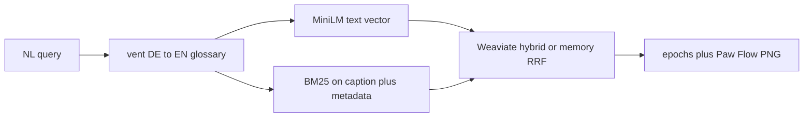

# Ventilator retrieval (Phase C)

This note documents how PhysioRAG retrieves ventilator epochs, what the
pairing/hybrid strategy is, and — importantly — what it deliberately does **not**
claim. It backs the Phase C exit criterion in
[`PROJECT_BRIEF_PhysioRAG.md`](../PROJECT_BRIEF_PhysioRAG.md): *vent queries return
plottable pressure/flow evidence; pairing/hybrid strategy documented (no fake
note-CLIP claims).*

## Pairing tiers (be honest about the data)

CLIP-style alignment needs text that describes the *same window* as the signal.
For ventilator data we tag every epoch with a `pairing_tier`:

| Tier | Source | Where | Use |
|------|--------|-------|-----|
| **medium** | Synthetic, labeled asynchrony windows with templated bilingual captions (e.g. `"PSV; double triggering; ARDS …"`) | `mimic_demo` via [`vent_captions.py`](../src/physiorag/ingestion/vent_captions.py) | Demo + retrieval eval |
| **weak** | Real `mimic4wdb` windows + auto-generated channel/description prose | [`wfdb_processor.py`](../src/physiorag/ingestion/wfdb_processor.py) | Domain demo only |
| — (excluded) | ICU free-text notes / loose `chartevents` joins as "captions" | not used | **never** treated as CLIP pairs |

Synthetic captions are **medium** tier, not strong CLIP pairs: they are templated
from ground-truth labels, not free-text morphology descriptions. ICU notes are
never used as captions — they summarize hours of care and rarely pin an event to
a 10-second window (see [`PROJECT_BRIEF_Physio-CLTP.md`](PROJECT_BRIEF_Physio-CLTP.md) §2).

For **real** `mimic4wdb` records the ventilator processor only ingests true
airway pressure/flow channels (`paw`/`awp`/`airway`/`flow`). A record with no
such channel is skipped rather than indexing an arterial (`ABP`/`ART`) or
impedance-respiration trace under the ventilator modality — so a "ventilator"
hit is always genuine pressure/flow evidence.

## Asynchrony catalog

The synthetic demo (`--dataset mimic_demo --modality ventilator`) emits one epoch
per scenario (or more with `variants`), each a 2-channel `Paw`/`Flow` window with
a distinct waveform shape and structured metadata:

- `double_triggering`, `air_trapping`, `ineffective_effort`, `flow_starvation`,
  `delayed_cycling`, `reverse_triggering`, plus low-compliance and normal
  controlled breaths.
- Metadata: `asynchrony_type`, `vent_mode`, `peep_cmh2o`, `diagnosis`, `finding`,
  `channels`, `pairing_tier`, and a bilingual (EN + DE) `text` caption.

The first four `record_id`s (`demo-ards-001` … `demo-ards-004`) are frozen so the
smoke demo, API, and citation tests stay stable.

## Hybrid retrieval = MiniLM captions + BM25 metadata (not text→signal)

The ventilator path is `retrieval.mode: hybrid_text`
([`configs/default.yaml`](../configs/default.yaml)):

1. The query is optionally rewritten by a small **vent-only** German→English
   glossary (`Beatmungsgerät → ventilator`, `Druckanstieg → pressure spike`, …)
   in [`vent_captions.py`](../src/physiorag/ingestion/vent_captions.py). English
   queries and non-vent vocabulary pass through unchanged. The glossary is only
   applied for the **ventilator** modality (or an unfiltered "all modalities"
   search); SpO2/ECG hybrid queries are never rewritten. It is also separate
   from the PTB-XL ECG glossary so the two never cross paths. The German half of
   every caption is stored with real umlauts (matching the UI chips), so a
   German query the glossary does not translate still matches on the caption.
2. The rewritten query is embedded with the local MiniLM **text** tower and
   hybrid-searched against the aligned `text` named vector **plus BM25** over the
   caption and promoted metadata properties (`asynchrony_type`, `diagnosis`,
   `finding`, `vent_mode`, `label`).
3. Fusion differs by store, on purpose:
   - **In-memory**: dense (text-cosine) and keyword rankings are fused with
     reciprocal rank fusion so an exact keyword hit can rescue a weak cosine
     match and vice versa. Keyword scoring tokenizes (umlaut-folded, stopwords
     dropped) over the same caption + promoted-metadata fields Weaviate scores,
     not a raw `str(metadata)` dump.
   - **Weaviate**: its native `hybrid()` fusion over the same
     `BM25_QUERY_PROPERTIES`. The two fusions are not identical; the in-memory
     path is for offline dry-runs, Weaviate is the product path.



**Not CLIP.** This is caption/metadata retrieval, not text→signal alignment. The
`baseline_cnn` waveform vectors are random-init and are stored only so a future
matched vent text tower (Physio-CLTP) can be dropped in behind `signal_aligned`
without re-ingesting. We do not nearest-neighbor MiniLM queries against those
waveform vectors — the spaces are unrelated (384-d text vs 128-d signal).

## Ingest / reset the demo collection

`mimic_demo` writes to the `WaveformEpochDemo` collection. Phase C added new
searchable Weaviate properties, so re-create the collection once:

```bash
python scripts/ingest_waveforms.py --dataset mimic_demo --modality ventilator --reset-collection
```

(The in-memory store needs no reset. `--reset-collection` only affects Weaviate.)
A collection created before Phase C lacks the promoted BM25 metadata properties;
Weaviate ignores property additions on an existing collection, so the store now
**fails loudly** at startup ("missing searchable metadata properties … re-ingest
with `--reset-collection`") instead of silently returning empty BM25 results.

## Evaluate (product metric, not CLIP)

[`scripts/eval_vent_retrieval.py`](../scripts/eval_vent_retrieval.py) runs a frozen
set of German/English Dräger-style queries against the synthetic corpus and
reports labeled Recall@k (a hit@k = an epoch of the gold `asynchrony_type` in the
top-k):

```bash
python scripts/eval_vent_retrieval.py --variants 3
# add --backend weaviate to score on the live product fusion (falls back to
# memory if Weaviate is not reachable); --no-distractors to drop the noise epochs
```

It reports **hybrid** (MiniLM + keyword/RRF), **MiniLM-only**, **keyword-only**,
and **chance**, and it splits queries into two subsets:

- **caption** queries reuse the caption vocabulary (keyword-only tends to tie
  hybrid here — expected, the captions embed the exact terms);
- **paraphrase** queries deliberately avoid the caption's words, so they are the
  honest test of whether dense (MiniLM) matching adds anything over keywords.

The corpus also includes unlabeled "controlled ventilation" **distractor** epochs
(scaled with `--variants`) so Recall is not trivially 1.0 and `chance` is
meaningful. The point of the eval is regression tracking and an honest baseline,
not a foundation-model claim. Writes `data/processed/vent_recall.json` (now with a
`by_subset` block).
